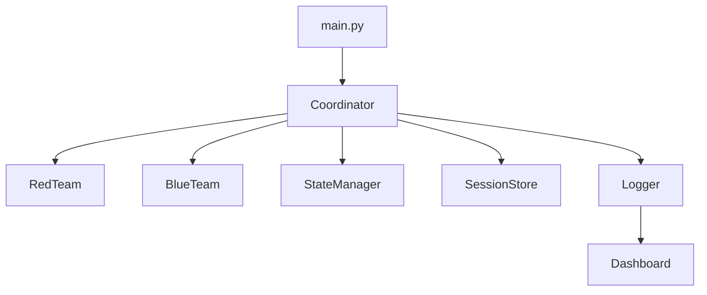

# Autonomous Multi-Agent Red/Blue Team Simulation System

Simulation-only agentic security framework for Australian SOCI Act critical infrastructure scenarios. No real exploitation, scanning, or payload execution occurs.

## Highlights
- 4 red team agents and 3 blue team agents operating in coordinated rounds
- MITRE ATT&CK technique mapping
- Structured JSON logging, SQLite session storage, and report generation
- Streamlit dashboard for live demo visibility
- SOCI Act + ASD Essential Eight context baked into scenarios

## Architecture (Quick View)



Full details in `docs/ARCHITECTURE.md`.

## Repository Layout
- `agents/` Red/blue team agents and base classes
- `orchestration/` Coordinator, message bus, state manager
- `mitre_integration/` MITRE ATT&CK mapping helpers
- `scenarios/` SOCI scenario definitions
- `storage/` SQLite session store and vector store wrapper
- `utils/` Logging and report utilities
- `dashboard/` Streamlit UI
- `docs/` Architecture, API, and design notes
- `tests/` Pytest suite

## Setup

```bash
python -m venv .venv
source .venv/bin/activate
pip install -r requirements.txt
```

Optional environment variables:

```bash
cp .env.example .env
```

## Development Setup

```bash
python -m venv .venv
source .venv/bin/activate
pip install -r requirements-dev.txt
```

## Run

```bash
python main.py --scenario soci_energy_grid --rounds 3
```

List available scenarios:

```bash
python main.py --list-scenarios
```

## Usage Examples

Run a short demo simulation:

```bash
python main.py --scenario soci_water_system --rounds 2
```

Programmatic usage:

```python
from orchestration.coordinator import Coordinator

coordinator = Coordinator(log_path="logs/simulation.log", session_db_path="logs/sessions.db")
result = coordinator.run("soci_telco_network", rounds=3)
```

## Scripts

```bash
./scripts/run_simulation.sh
./scripts/run_dashboard.sh
```

## Dashboard

```bash
streamlit run dashboard/streamlit_ui.py
```

## Tests

```bash
pytest
```

## Linting and Formatting

```bash
ruff check .
ruff format .
```

## Safety & Ethics
- Simulation-only; documentation-only outputs
- No real payloads, scanning, or exploitation
- Includes SOCI Act and Privacy Act 1988 considerations

## Documentation
- Architecture: `docs/ARCHITECTURE.md`
- API Reference: `docs/API.md`
- Design Notes: `docs/DESIGN.md`
- Usage Guide: `docs/USAGE.md`

## License
MIT. See `LICENSE`.
