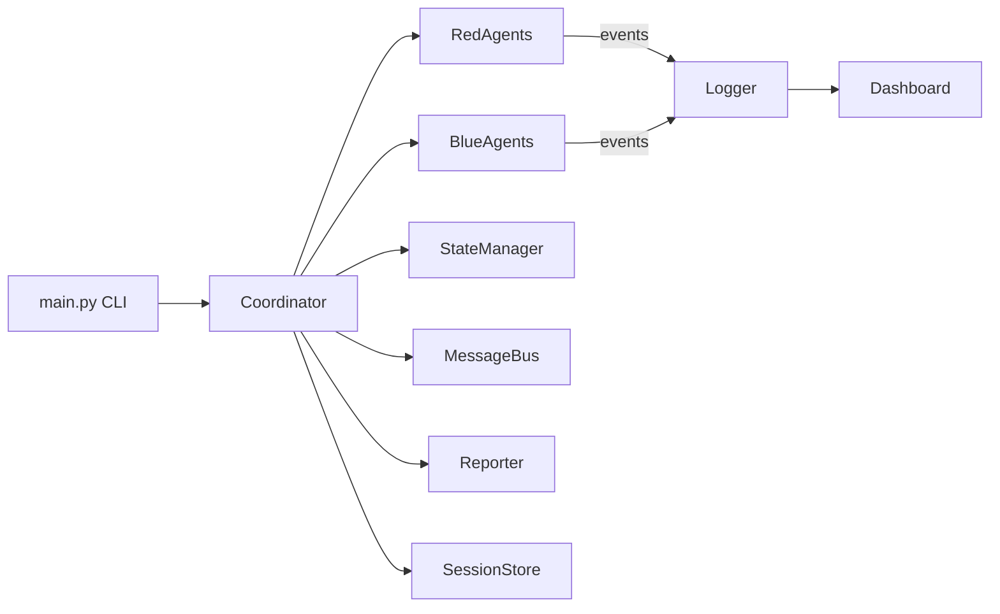

# Architecture Overview

## Goals
- Simulate red/blue team operations in a controlled, safe environment
- Align with Australian SOCI Act critical infrastructure context
- Produce consistent logs, reports, and dashboards for demos

## High-Level Architecture

## Components
- **Coordinator**: Orchestrates rounds, dispatches tasks, manages state
- **Agents**: Red/blue team simulation logic with MITRE mapping
- **Message Bus**: Pub/sub for inter-agent messaging
- **State Manager**: Central state snapshot and event tracking
- **Session Store**: SQLite persistence for sessions/events
- **Reporting**: JSON report + Markdown summary
- **Dashboard**: Streamlit UI for live view

## Data Flow
1. CLI starts simulation with scenario and rounds.
2. Coordinator triggers agents; each produces simulated outputs.
3. Logs and events are persisted.
4. Reports are generated and displayed via dashboard.

## Security and Safety
- No real scanning or exploitation
- Simulation-only outputs
- Privacy and SOCI compliance references in scenarios
